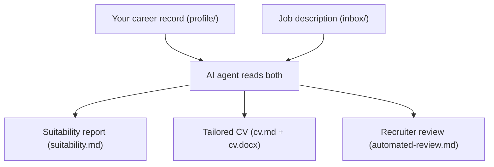

# Career Record Helper

A template repository for managing your career history and automating job applications using AI coding assistants. You maintain a comprehensive, private master record of your experience, then use LLM-powered agents to screen job descriptions, assess suitability, generate tailored CVs, and produce simulated recruiter reviews — all from a single conversational prompt.

> [!IMPORTANT]
> This repository ships with AI-generated sample content. "Elena Vasquez" and any other names, organisations, or contact details are placeholders. Replace all sample data with your own details before real use.

> [!TIP]
> Treat this repository as private data. Keep it in a private repo and avoid committing sensitive personal information unless you are comfortable storing it in git history.

## How it works



1. **Build your career record** — replace the sample data in `profile/` with your own work history, personal projects, articles, and job preferences.
2. **Drop in a job description** — save the job posting into the `inbox/` folder in any readable format: PDF, image (e.g. a screenshot), Markdown, or Word document.
3. **Ask your AI assistant to "review the inbox"** — the agent reads your career record, parses the job description, and generates three artefacts per role. How you trigger this depends on your tool:
   - **Claude Code (CLI):** run `claude` in the repo root and prompt `"Review the inbox and process all job descriptions"` or similar.
   - **GitHub Copilot or Codex in VSCode:** open the chat panel, set the context to this workspace, and send the same prompt
   - **Cursor:** open the repo and use Composer or Chat with the prompt above
   - **Agentic / automated workflow:** point a GitHub Actions job or any agentic runner at this private repo and issue the prompt programmatically

   The agent produces three artefacts per role:
   - **Suitability report** — a structured assessment of job fit against your stated preferences and experience
   - **Tailored CV** — a role-specific CV in Markdown and styled Word (.docx) format, drawn only from facts in your record
   - **Automated review** — a simulated recruiter critique of the generated CV against the job description
4. **Track your applications** — each role gets a folder under `output/` with a status file that records the application journey, for example `_APP_INT_OFF_ACC` (i.e. applied → interviewed → offered → accepted).

## Who this is for

Any software engineer who wants a repeatable application workflow, regardless of seniority (junior to principal/staff), stack, or specialisation. The sample data in this repo is frontend-focused, but the structure is generic — adapt it by replacing the content and preference files.

## Supported AI tools

The repository ships with configuration files for:

- **GitHub Copilot** (`.github/copilot-instructions.md`)
- **Claude Code** (`CLAUDE.md`)
- **OpenAI Codex** (`AGENTS.md`)
- **Cursor** (`.cursorrules`)

All point to a shared instruction set at `infrastructure/agent-instructions.md`, so the workflow is consistent regardless of which tool you use.

## Getting started

### Prerequisites

**Required — for CV docx generation:**

| Tool | Version | Why |
|------|---------|-----|
| [Python](https://www.python.org/) | 3.x | CV docx script runtime |
| [Pandoc](https://pandoc.org/) | latest | Markdown-to-Word conversion |
| [python-docx](https://python-docx.readthedocs.io/) | latest | Word document post-processing |

```bash
pip install python-docx
```

**Optional — only needed for linting and repo checks:**

| Tool | Version | Why |
|------|---------|-----|
| [Node.js](https://nodejs.org/) | 24.x | Script runtime for linting tools |
| [pnpm](https://pnpm.io/) | 10.x | Package manager |

### Setup

```bash
git clone <your-private-fork-or-repo>
cd career-record-helper
pnpm install  # optional — only needed for linting/spellcheck

# Replace sample data with your own
# - profile/work-experience/     → one file per role you've held
# - profile/personal-projects/   → one file per personal project
# - profile/cross-cutting/       → experience spanning multiple roles
# - profile/articles/            → published articles and writing
# - profile/job-preferences.md   → your job preferences and constraints
# - infrastructure/sample-cv.md  → your CV template with real contact details
```

### First run

1. Save one or more job descriptions into `inbox/` (PDF, image, Markdown, or Word).
2. Open this repo with your AI coding assistant. For example:
   - Run `claude` in the repo root (Claude Code CLI)
   - Open the folder in VSCode with the Copilot or Codex extension active
   - Open the folder in Cursor
3. Prompt: **"Review the inbox and process all job descriptions."**

The standard flow:
1. Create `output/<YYYYMMDD-company-role>/`
2. Generate `suitability.md`
3. (On request) generate `cv.md` and `cv.docx`
4. Generate `automated-review.md`
5. Create a status file like `_REVIEW`

## Repository structure

```
.
├── inbox/                     # Drop zone for unprocessed job descriptions (any readable format)
├── profile/                   # Your career record and preferences
│   ├── work-experience/       #   Employment history (one file per role)
│   ├── personal-projects/     #   Personal project documentation
│   ├── cross-cutting/         #   Experience spanning multiple roles
│   ├── articles/              #   Published articles and writing
│   └── job-preferences.md     #   Your job fit preferences and constraints
├── output/                    # Job applications (one folder per application)
│   └── YYYYMMDD-company-role/
│       ├── job-description.<ext>
│       ├── suitability.md
│       ├── cv.md
│       ├── cv.docx
│       ├── automated-review.md
│       └── _<STATUS>          #   Application status tracker
├── infrastructure/            # Shared AI instructions, templates, and tooling
│   ├── agent-instructions.md         # Primary operating guide for AI agents
│   ├── cv-generation-instructions.md # CV generation rules and workflow
│   ├── job-screening-instructions.md # Screening rubric and output format
│   ├── llm-role-instructions.md      # Spec for work experience file format
│   ├── llm-personal-project-instructions.md # Spec for personal project file format
│   ├── generate-cv-docx.py           # Markdown → styled .docx script
│   ├── sample-cv.md / .docx          # CV structure template and style reference
│   └── glossary.md                   # Naming conventions and standards
├── scripts/                   # Repository tooling (linting, validation)
└── .github/ / CLAUDE.md / AGENTS.md / .cursorrules  # AI tool config
```

## Key docs

- `infrastructure/agent-instructions.md` — primary operating guide for AI agents
- `infrastructure/cv-generation-instructions.md` — CV generation workflow
- `profile/job-preferences.md` — your job fit preferences (user-maintained)
- `infrastructure/job-screening-instructions.md` — screening rubric and output format
- `infrastructure/llm-role-instructions.md` — work experience file authoring standard
- `infrastructure/llm-personal-project-instructions.md` — personal project file standard
- `infrastructure/glossary.md` — naming conventions and terminology

## Useful commands

```bash
pnpm lint:career-record          # Structural checks (folder names, status files, frontmatter)
pnpm lint:career-record:strict   # Structural checks + warnings fail build
pnpm spellcheck                  # Markdown spell check
pnpm typecheck                   # TypeScript type check (repo scripts)
```
